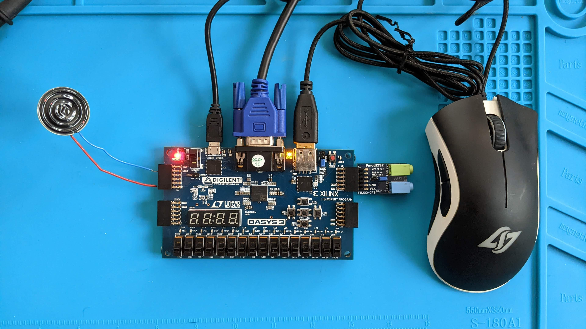
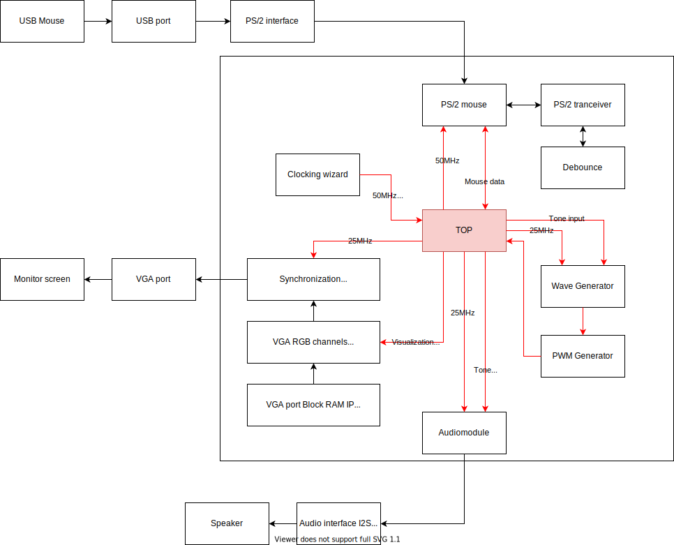

# FPGA Mouse Synthesizer with VGA Visualization

A Digilent Basys3 FPGA board project for Digital Systems Development at AP University of Applied Sciences and Arts Antwerp.

By Bavo Debraekeleer

## Table of Contents

[Introduction](#introduction)

[Development Plan](#development-plan)

[Testing Plan](#testing-plan)

[Future Development](#future-development)

[Explaining the Functionality](#explaining-the-functionality)

[Troubleshooting](#troubleshooting)

[Cited Works](#cited-works)

## Introduction

This is a project for the course Digital Systems Development at AP University of Applied Sciences and Arts Antwerp. It is developed on the Digilent Basys3 FPGA board with Xilinx Vivado 2022.2. The aim is to build a Synthesizer, or tone generator, based on the input of a computer mouse and a monitor, or computer screen, for visualization. 

## Development Plan

### Components of the project

The project can be split up in six different components:

1. A top component to manage all signals, inputs and outputs.
2. Input of the computer mouse through the PS/2 interface.
3. Clocking wizard to produce the necessary clocks from the internal 100MHz clock.
4. The tone generator using Pulse Width Modulation.
5. Output of the tone through analogue port or I2S interface (pmodI2S2). 
6. Output to the monitor through the VGA port.

### Phases

1. The first phase is to to research the different components and to gather resources and IP.
2. The second phase is to test the individual components and make sure they all work.
3. The third and last phase is to bring everything together to a working whole using the top file.

## Testing Plan

The testing will be done by building or resourcing the necessary components and first testing them individually to verify their proper functioning.

After all components have been verified are connected one by one together through the top component. After each addition the whole is tested to identify problems early on where possible.

Testing and validation is done in different ways.

1. Using the RTL Analysis: Elaborated Design schematic
   This gives a clear and readable overview of all the inputs, blocks, signals and outputs defined in the VHDL code.
2. Logs and Messages in Vivado when running Synthesis, Implementation and Generate Bistream.
3. Programming the board to test the actual functioning of the code.
4. Running simulations to verify and troubleshoot by visualizing signals. This allows to visualize the timing of signals and verify if you get the signals you expect.

## Explaining the Functionality

*Reproduceerbaarheid / Tutorial achtige uitleg zoals de slides van de cursus.*

## Future Development

In the future the project can be used in a music application. For example a song for which the notes are displayed on the screen and the user has to aim towards the correct note and in the rhythm of the song.

The mouse as an input can be expanded to include mouse clicks on which to generate the tone.

Other input types can be explored as well.

## Troubleshooting

*Ervaarde moeilijkheden / gevonden oplossingen*

**ER WERKT GEEN HOL!**

## Cited Works

Ing. Dirk Van Merode MSc. *Digital Systems Development course material.*

fpga4student (no date) *[FPGA tutorial] how to interface a mouse with Basys 3 FPGA*, *FPGA Projects, Verilog Projects, VHDL Projects - FPGA4student.com*. Available at: https://www.fpga4student.com/2017/12/how-to-interface-mouse-with-FPGA.html (Accessed: January 8, 2023). 

MavisT2 and Instructables (2017) *BASYS3 FPGA digital audio synthesizer*, *Instructables*. Instructables. Available at: https://www.instructables.com/Basys3-FPGA-Digital-Audio-Synthesizer/ (Accessed: January 8, 2023). 

Scott_1767 (2021) *PS/2 Mouse Interface (VHDL)*, *Key*. Available at: https://forum.digikey.com/t/ps-2-mouse-interface-vhdl/12617 (Accessed: January 8, 2023). 

Scott_1767 (2021) *VGA controller (VHDL)*, *Key*. Available at: https://forum.digikey.com/t/vga-controller-vhdl/12794 (Accessed: January 8, 2023). 
